# Mermaid Template Library

> **⚠️ Before writing any code, read [`_rules.md`](references/_rules.md) — three non-negotiable rules on overlap, hierarchy, and color.**


Mermaid is the best "text-as-diagram" solution — write structural diagrams with Markdown-like syntax, zero design skills needed.
Best for: flowcharts, sequence diagrams, architecture diagrams, Gantt charts, class diagrams, ER diagrams, mind maps, state diagrams, pie charts, Git branch graphs.

**Core advantages**: text is version-controllable, minimal maintenance cost, high rendering consistency, CJK support.

## ⚠️ Flowchart Quality Rules (Highest Priority)

### Font Size Control
Mermaid font sizes are controlled via `themeVariables` and CSS:
- `fontSize`: Global font size, recommended `14px`-`16px`, **no less than 12px**
- Node text is controlled via `fontSize` or `%%{init:}%%` directive
- Annotations/footnotes use subgraph titles or separate nodes, font size no less than `11px`

### Connectors & Spacing
```javascript
flowchart: {
  padding: 32,           // Node padding (CJK needs more space)
  nodeSpacing: 80,       // Horizontal spacing between nodes (default 50 too tight, 60 still not enough)
  rankSpacing: 80,       // Vertical spacing between ranks
  curve: 'basis',        // Connection curve style, consistent across the chart
}
```

**Connector style must be consistent throughout the chart**: do not mix straight, curved, and polylines in the same diagram. Mermaid controls this globally via the `curve` parameter.

### ⚠️ Mermaid Flowchart Hard Constraints (MANDATORY)

The following constraints are enforced **when generating Mermaid flowchart code**, not as post-checks:

1. **Node text must be wrapped in quotes**: `A["用户登录"]` ✅ / `A[用户登录]` ❌ — quotes prevent CJK special characters from causing parse errors
2. **Max 10 CJK characters per line in node text**: exceed → use `<br>` to break → `A["用户身份<br>验证模块"]`
3. **Max 5 nodes per subgraph**: exceed → split into multiple subgraphs or switch to CSS approach
4. **Max 10 total nodes**: exceed → switch to CSS flowchart template in `references/playwright-css.md`
5. **Max 6 CJK characters in connector labels**: `-->|验证通过|` ✅ / `-->|用户身份验证通过后跳转|` ❌
6. **Config params must use enlarged values**: `padding: 32, nodeSpacing: 80, rankSpacing: 80`

## Rendering Methods

### Method 1: Playwright + HTML (Recommended, export PNG/SVG/PDF)

```html
<!DOCTYPE html>
<html lang="zh">
<head>
<meta charset="UTF-8">
<script src="https://cdn.jsdelivr.net/npm/mermaid@11/dist/mermaid.min.js"></script>
<style>
  * { margin: 0; padding: 0; box-sizing: border-box; }
  body {
    background: #FFFFFF;
    font-family: -apple-system, BlinkMacSystemFont, 'PingFang SC', 'SimHei', sans-serif;
    display: flex;
    justify-content: center;
    padding: 48px;
  }
  #diagram { width: fit-content; min-width: 800px; }
</style>
</head>
<body>
<div id="diagram">
  <pre class="mermaid">
    <!-- Mermaid code goes here -->
  </pre>
</div>
<script>
  mermaid.initialize({
    startOnLoad: true,
    theme: 'base',
    themeVariables: {
      // See "Theme configuration" below
    },
    flowchart: { 
      curve: 'basis', 
      padding: 32,           // Node padding (CJK chars 50% wider than Latin, need more space)
      nodeSpacing: 80,       // Horizontal spacing (prevents CJK node overlap)
      rankSpacing: 80,       // Vertical spacing between ranks (prevents overlap between levels)
      htmlLabels: true,      // Enable HTML label rendering, supports line breaks
      wrappingWidth: 160,    // Max text width before auto-wrap (160 wraps earlier than 200, prevents overly wide nodes)
    },
    sequence: { mirrorActors: false, messageAlign: 'center' },
    gantt: { titleTopMargin: 25, barHeight: 24, barGap: 6 },
  });
</script>
</body>
</html>
```

**Python screenshot script**:

```python
import asyncio
from playwright.async_api import async_playwright

async def mermaid_to_png(html_path, png_path, width=1400, scale=2):
    async with async_playwright() as p:
        browser = await p.chromium.launch(headless=True)
        page = await browser.new_page(
            viewport={'width': width, 'height': 800},
            device_scale_factor=scale
        )
        await page.goto(f'file://{html_path}', wait_until='load', timeout=30000)
        
        # Wait for Mermaid SVG to render
        await page.wait_for_selector('#diagram svg', timeout=15000)
        await page.wait_for_timeout(1000)
        
        # ⚠️ Read SVG's ACTUAL rendered size (not CSS box model!)
        # Mermaid SVGs often overflow their CSS container — getBBox/clientRect
        # returns the true size, while CSS bounding_box() returns the clipped box.
        svg_size = await page.evaluate('''() => {
            const svg = document.querySelector('#diagram svg');
            if (!svg) return null;
            const r = svg.getBoundingClientRect();
            return { width: r.width, height: r.height };
        }''')
        
        el = page.locator('#diagram')
        css_bbox = await el.bounding_box()
        
        svg_w = svg_size['width'] if svg_size else width
        svg_h = svg_size['height'] if svg_size else 800
        css_w = css_bbox['width'] if css_bbox else width
        css_h = css_bbox['height'] if css_bbox else 800
        
        # Use the LARGER of CSS box and SVG actual size
        fit_w = max(width, int(max(svg_w, css_w) + 200))
        fit_h = int(max(svg_h, css_h) + 200)
        
        await page.set_viewport_size({'width': fit_w, 'height': fit_h})
        await page.wait_for_timeout(500)
        
        await el.screenshot(path=png_path)
        await browser.close()
        
        import os
        print(f'✅ {png_path} ({os.path.getsize(png_path)/1024:.0f}KB)')

# asyncio.run(mermaid_to_png('./output/diagram.html', './output/diagram.png'))
```

> **⚠️ CRITICAL: CSS `bounding_box()` vs SVG actual size**
>
> Mermaid generates SVGs that can be wider/taller than their CSS container. `bounding_box()` (Playwright) and `getBoundingClientRect()` on the container return **CSS box model size**, which may be smaller than the SVG's viewBox.
>
> **Always read the SVG element's own `getBoundingClientRect()`** via `page.evaluate()` and use `max(css_size, svg_size)` for viewport dimensions. This is the root cause of the "right side clipped" bug.
>
> Also: `wait_until='load'` is preferred over `'networkidle'` because Mermaid initializes on DOM load. `'networkidle'` can timeout if CDN is slow.

### Method 2: Mermaid CLI (mmdc, command line)

```bash
# Installation
npm install -g @mermaid-js/mermaid-cli

# Usage: .mmd file → PNG/SVG/PDF
mmdc -i diagram.mmd -o diagram.png -w 1200 -b transparent
mmdc -i diagram.mmd -o diagram.svg
mmdc -i diagram.mmd -o diagram.pdf

# Specify theme configuration
mmdc -i diagram.mmd -o diagram.png --configFile mermaid-config.json
```

`mermaid-config.json` example:

```json
{
  "theme": "base",
  "themeVariables": {
    "primaryColor": "#EFF6FF",
    "primaryBorderColor": "#3B82F6",
    "primaryTextColor": "#1E293B",
    "lineColor": "#94A3B8",
    "secondaryColor": "#F0FDF4",
    "tertiaryColor": "#FFF7ED"
  }
}
```

### Method 3: Online Preview

Paste code at [mermaid.live](https://mermaid.live) for instant preview and export.

---

## Theme Configuration (Design System Integration)

Mermaid uses `theme: 'base'` + `themeVariables` for fully custom colors.
The following themes align with the charts skill mood color system:

### Business Professional (Default)

```javascript
themeVariables: {
  primaryColor: '#EFF6FF',        // Node background (very light blue)
  primaryBorderColor: '#3B82F6',  // Node border (blue)
  primaryTextColor: '#1E293B',    // Node text (dark gray-blue)
  lineColor: '#94A3B8',           // Connectors (gray)
  secondaryColor: '#F0FDF4',      // Secondary nodes (very light green)
  secondaryBorderColor: '#10B981',
  secondaryTextColor: '#1E293B',
  tertiaryColor: '#FFF7ED',       // Tertiary nodes (very light amber)
  tertiaryBorderColor: '#F59E0B',
  tertiaryTextColor: '#1E293B',
  noteBkgColor: '#F8FAFC',        // Note background
  noteTextColor: '#6B7280',
  noteBorderColor: '#E2E8F0',
  fontSize: '14px',
  fontFamily: '-apple-system, BlinkMacSystemFont, PingFang SC, SimHei, sans-serif',
}
```

### Tech Dark

```javascript
themeVariables: {
  primaryColor: '#1E293B',
  primaryBorderColor: '#3B82F6',
  primaryTextColor: '#F1F5F9',
  lineColor: '#475569',
  secondaryColor: '#0F2E1F',
  secondaryBorderColor: '#10B981',
  secondaryTextColor: '#F1F5F9',
  tertiaryColor: '#1A1625',
  tertiaryBorderColor: '#8B5CF6',
  tertiaryTextColor: '#F1F5F9',
  noteBkgColor: '#0F172A',
  noteTextColor: '#94A3B8',
  noteBorderColor: '#334155',
  fontSize: '14px',
  fontFamily: '-apple-system, BlinkMacSystemFont, PingFang SC, SimHei, sans-serif',
  background: '#0F172A',
}
```

---

## Template 1: Flowchart

The most common chart type. Supports directions: `TB` (top→bottom), `LR` (left→right), `BT`, `RL`.

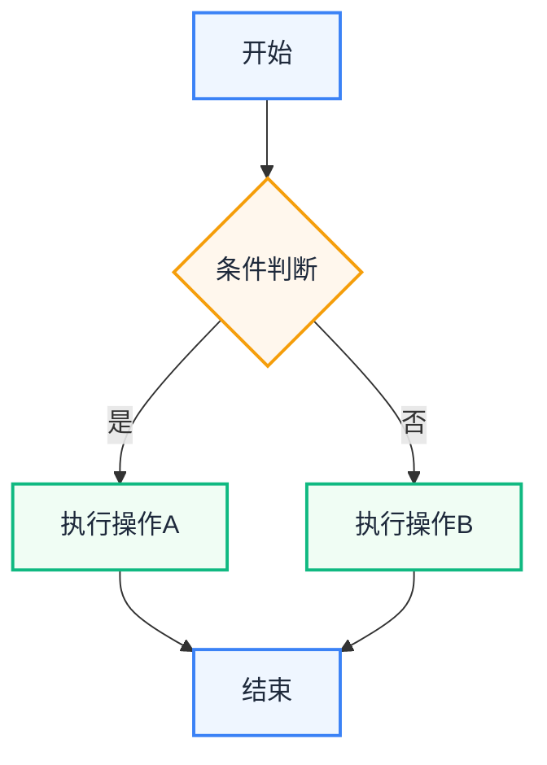

### Node Shape Quick Reference

| Syntax | Shape | Use For |
|------|------|--------|
| `A[text]` | Rectangle | Steps/Actions |
| `A(text)` | Rounded rect | General nodes |
| `A([text])` | Stadium | Start/End |
| `A{text}` | Diamond | Decision |
| `A{{text}}` | Hexagon | Preparation |
| `A[/text/]` | Parallelogram | Input/Output |
| `A((text))` | Circle | Connector |
| `A>text]` | Flag | Event/Signal |

### Subgraphs (Grouping)

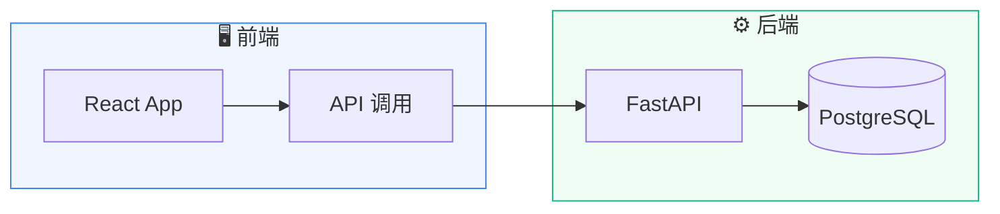

---

## Template 2: Sequence Diagram

Shows interaction sequence between systems/actors.

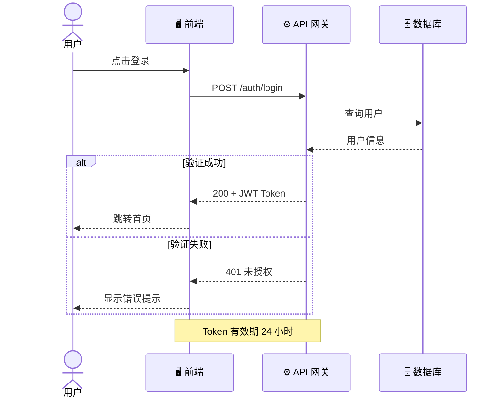

### Arrow Types

| Syntax | Meaning |
|------|------|
| `->>` | Solid arrow (synchronous call) |
| `-->>` | Dashed arrow (return/response) |
| `-x` | Solid with x (failure/rejection) |
| `-)` | Async message |

---

## Template 3: Architecture Diagram (C4 Style via Subgraphs)

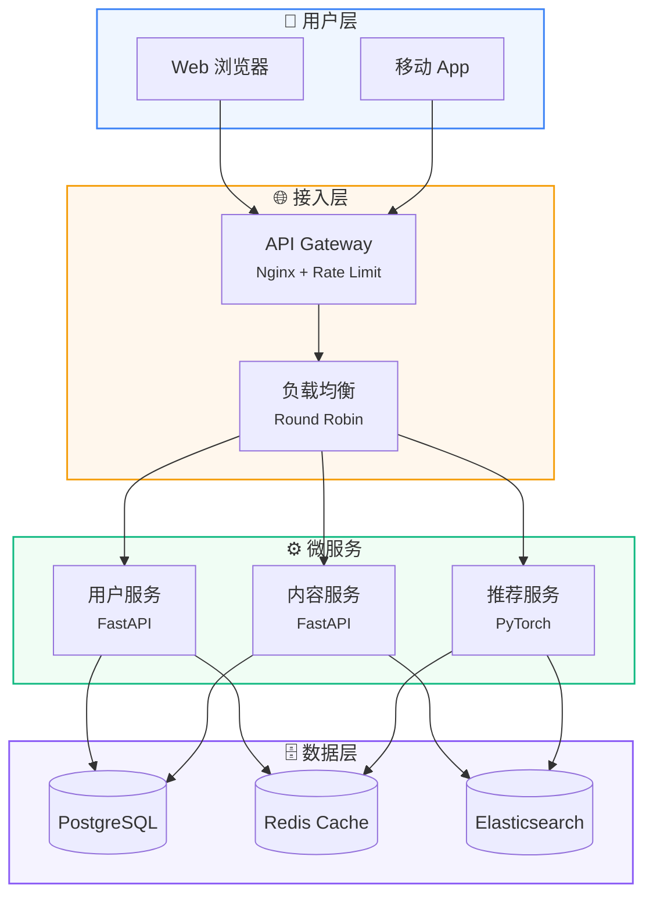

---

## Template 4: Gantt Chart

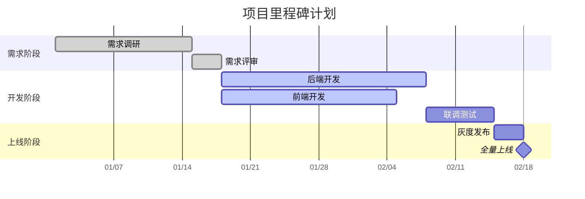

---

## Template 5: Class Diagram

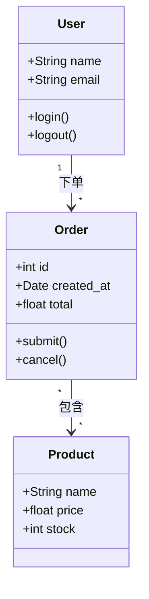

---

## Template 6: ER Diagram

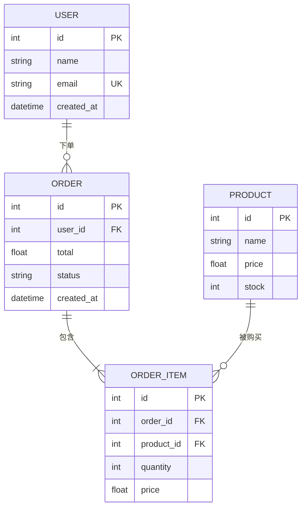

---

## Template 7: Mind Map

> ⚠️ Mermaid mindmap has limited layout capabilities. **For high-quality mind maps**, prefer `references/mindmap-css.md`.
> The following approach is for **quick drafts** or embedding in Markdown documents, with CSS injection to optimize visual quality.

### Optimized HTML Shell (Important! Use this, not the default template)

Mermaid mindmap doesn't support `style`/`classDef`, but you can greatly improve results with **CSS overriding SVG styles** + **themeVariables**:

```html
<!DOCTYPE html>
<html lang="zh">
<head>
<meta charset="UTF-8">
<script src="https://cdn.jsdelivr.net/npm/mermaid@11/dist/mermaid.min.js"></script>
<style>
  * { margin: 0; padding: 0; box-sizing: border-box; }
  body {
    background: #FFFFFF;
    font-family: -apple-system, BlinkMacSystemFont, 'PingFang SC', 'SimHei', sans-serif;
    display: flex;
    justify-content: center;
    padding: 48px;
  }
  #diagram { min-width: 900px; }

  /* ─── CSS injection to optimize Mermaid mindmap rendering ─── */
  /* 
   * Actual SVG class names in Mermaid v11 mindmap:
   * - .section-root = root node
   * - .section-0 ~ .section-N = first-level branches (in order)
   * - .section-edge-0 ~ .section-edge-N = connectors for corresponding branches
   * - .node-bkg = node background path
   * - .node-line- = node bottom decoration line
   * - .nodeLabel = text label
   * - .edge = connector
   * - .edge-depth-1/5 = connector depth level
   */

  /* 1. All connectors: rounded, soft */
  .edge { stroke-width: 2px !important; stroke-linecap: round !important; }

  /* 2. Remove node bottom decoration line (ugly by default) */
  .node-line- { stroke: transparent !important; }

  /* 3. Root node: deep blue circle + shadow */
  .section-root circle,
  .section-root ellipse {
    fill: #1E40AF !important;
    stroke: #1E3A8A !important;
    stroke-width: 3px !important;
    filter: drop-shadow(0 4px 12px rgba(30,64,175,0.35));
  }
  .section-root .nodeLabel { color: #FFFFFF !important; font-size: 17px !important; font-weight: 700 !important; }

  /* 4. First-level branches colored in order (supports up to 8-color cycle) */
  /* Blue */
  .section-0 .node-bkg { fill: #DBEAFE !important; stroke: #3B82F6 !important; stroke-width: 2px !important; }
  .section-0 .nodeLabel { color: #1E40AF !important; font-weight: 600 !important; font-size: 14px !important; }
  .section-edge-0 { stroke: #93C5FD !important; }
  /* Green */
  .section-1 .node-bkg { fill: #D1FAE5 !important; stroke: #10B981 !important; stroke-width: 2px !important; }
  .section-1 .nodeLabel { color: #065F46 !important; font-weight: 600 !important; font-size: 14px !important; }
  .section-edge-1 { stroke: #6EE7B7 !important; }
  /* Amber */
  .section-2 .node-bkg { fill: #FEF3C7 !important; stroke: #F59E0B !important; stroke-width: 2px !important; }
  .section-2 .nodeLabel { color: #92400E !important; font-weight: 600 !important; font-size: 14px !important; }
  .section-edge-2 { stroke: #FCD34D !important; }
  /* Purple */
  .section-3 .node-bkg { fill: #EDE9FE !important; stroke: #8B5CF6 !important; stroke-width: 2px !important; }
  .section-3 .nodeLabel { color: #5B21B6 !important; font-weight: 600 !important; font-size: 14px !important; }
  .section-edge-3 { stroke: #C4B5FD !important; }
  /* Red */
  .section-4 .node-bkg { fill: #FEE2E2 !important; stroke: #EF4444 !important; stroke-width: 2px !important; }
  .section-4 .nodeLabel { color: #991B1B !important; font-weight: 600 !important; font-size: 14px !important; }
  .section-edge-4 { stroke: #FCA5A5 !important; }
  /* Cyan */
  .section-5 .node-bkg { fill: #CFFAFE !important; stroke: #06B6D4 !important; stroke-width: 2px !important; }
  .section-5 .nodeLabel { color: #155E75 !important; font-weight: 600 !important; font-size: 14px !important; }
  .section-edge-5 { stroke: #67E8F9 !important; }
  /* Pink */
  .section-6 .node-bkg { fill: #FCE7F3 !important; stroke: #EC4899 !important; stroke-width: 2px !important; }
  .section-6 .nodeLabel { color: #9D174D !important; font-weight: 600 !important; font-size: 14px !important; }
  .section-edge-6 { stroke: #F9A8D4 !important; }
  /* Gray-green */
  .section-7 .node-bkg { fill: #D1FAE5 !important; stroke: #059669 !important; stroke-width: 2px !important; }
  .section-7 .nodeLabel { color: #064E3B !important; font-weight: 600 !important; font-size: 14px !important; }
  .section-edge-7 { stroke: #6EE7B7 !important; }

  /* 5. Deeper connectors are lighter */
  .edge-depth-5 { stroke-width: 1.5px !important; opacity: 0.6; }

  /* 6. Light gray background */
  body { background: #FAFBFE; }
</style>
</head>
<body>
<div id="diagram">
  <pre class="mermaid">
mindmap
    root((你的主题))
        一级分支1
            二级内容A
            二级内容B
        一级分支2
            二级内容C
  </pre>
</div>
<script>
  mermaid.initialize({
    startOnLoad: true,
    theme: 'base',
    themeVariables: {
      primaryColor: '#EFF6FF',
      primaryBorderColor: '#3B82F6',
      primaryTextColor: '#1E293B',
      lineColor: '#CBD5E1',
      fontSize: '13px',
      fontFamily: '-apple-system, BlinkMacSystemFont, PingFang SC, SimHei, sans-serif',
    },
    mindmap: {
      padding: 20,
      useMaxWidth: false,
    }
  });
</script>
</body>
</html>
```

### Auto-Upgrade Rules (Important!)

> ⚠️ **Never trim user content just to fit Mermaid!**
> Content comes first; tools serve content, not the other way around.

When content complexity exceeds Mermaid mindmap's comfort zone, **auto-switch to CSS approach** (`references/mindmap-css.md`):

| Trigger Condition (any one met) | Action |
|----------------------|------|
| More than 7 L1 branches | → Switch to CSS |
| Any branch has >8 child nodes | → Switch to CSS |
| Nesting exceeds 3 levels | → Switch to CSS |
| Single node text >15 chars | → Switch to CSS |
| Total nodes >40 | → Switch to CSS |

**When none of the above triggers**, Mermaid mindmap is adequate. The following suggestions help optimize rendering (recommendations, not hard limits):

| Suggestion | Notes |
|------|------|
| Keep node text concise | Use spaces to segment long text, avoid punctuation |
| Use emoji prefixes per branch | Higher visual distinctiveness |
| Use CSS injection for coloring | Use the optimized HTML shell above |

### Example (Optimized)

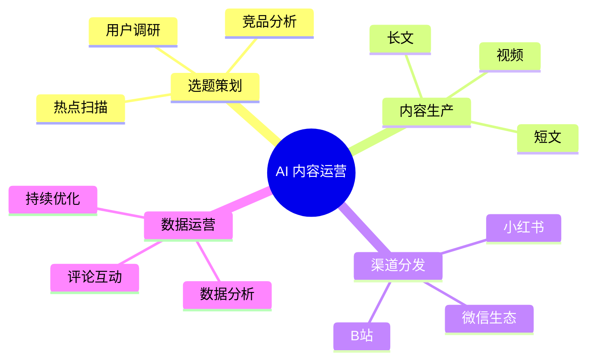

### Known Limitations of Mermaid Mindmap

- ❌ No `style` / `classDef` support for direct node coloring (CSS injection of SVG styles only)
- ❌ Line thickness/curvature cannot be controlled from Mermaid syntax (CSS override `.mindmap-edge`)
- ❌ Node spacing calculated by algorithm, cannot be manually specified
- ❌ Long CJK text easily overlaps with connectors (strict character count control needed)
- ⚠️ CSS injection depends on Mermaid internal class naming, may break on version upgrades

**Conclusion**: For quick drafts use Mermaid + the CSS-optimized shell above; for production output use CSS mind map → `references/mindmap-css.md`

---

## Template 8: State Diagram

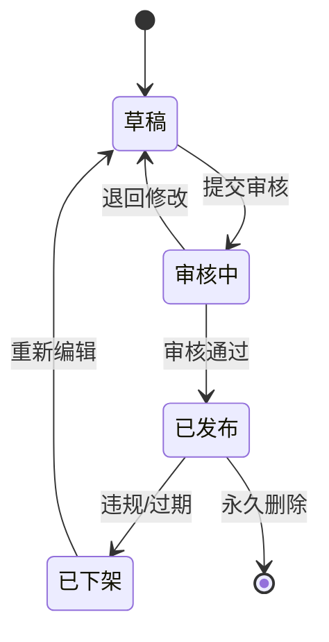

---

## Template 9: Git Branch Graph

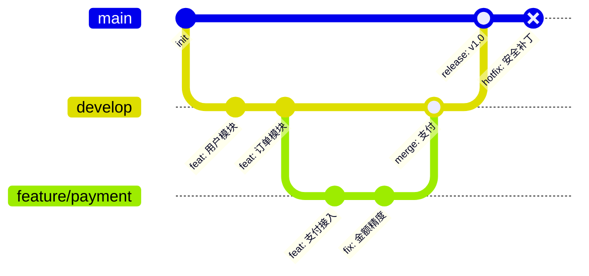

---

## Styling Tips

### Single Node Style

```mermaid
style 节点ID fill:#EFF6FF,stroke:#3B82F6,stroke-width:2px,color:#1E293B
```

### Batch Styles (classDef)

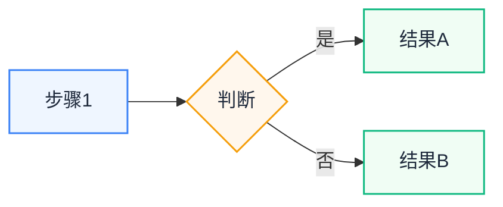

### Connector Styles

```mermaid
%% Style for the N-th connector (0-indexed)
linkStyle 0 stroke:#3B82F6,stroke-width:2px
linkStyle 1 stroke:#10B981,stroke-width:2px,stroke-dasharray: 5 5
```

---

## Mermaid vs Other Approaches

| Capability | Mermaid | Playwright+CSS | draw.io |
|------|---------|---------------|---------|
| Learning curve | ✅ Very low (Markdown-like) | Medium (HTML/CSS) | ✅ Very low (drag&drop) |
| Version control friendly | ✅ Plain text | ✅ Plain text | ❌ XML binary |
| Flowcharts | ✅ Built-in | ⚠️ Manual layout | ✅ Drag&drop |
| Sequence diagrams | ✅ Built-in | ❌ Very complex | ✅ Templates |
| Gantt charts | ✅ Built-in | ❌ Build from scratch | ⚠️ Limited |
| Class/ER diagrams | ✅ Built-in | ❌ Not suited | ✅ Templates |
| Visual freedom | ⚠️ Limited | ✅ Full freedom | ✅ Free |
| PNG export | ✅ mmdc/Playwright | ✅ Playwright | ✅ Built-in |
| CJK support | ✅ Native | ✅ Font config | ✅ Native |
| Auto layout | ✅ Automatic | ❌ Manual | ⚠️ Semi-auto |

**Principle: Use Mermaid for structural/relationship diagrams, Playwright+CSS for creative design diagrams.**

---

## FAQ

### Q: CJK node names cause layout issues?

Ensure `fontFamily` includes a CJK font:
```javascript
themeVariables: {
  fontFamily: '-apple-system, PingFang SC, SimHei, sans-serif'
}
```

### Q: How to control node spacing?

Mermaid auto-layouts; spacing is adjusted via config:
```javascript
flowchart: { padding: 16, nodeSpacing: 50, rankSpacing: 60 }
```

### Q: Chart too large?

- Split into subgraphs
- Change direction (`TB` too tall → switch to `LR`)
- Use `mmdc -w 1600` to increase canvas width

### Q: How to add line breaks in nodes?

Use `<br>` tags:
```mermaid
A[第一行<br>第二行<br><small>小字注释</small>]
```

### Q: Flowchart node text truncated or overlapping?

**Common causes and fixes**:

1. **Insufficient node padding**: ensure `flowchart.padding` is at least `24` (CJK chars are ~50% wider than Latin)
2. **Text too long**: use `<br>` for manual line breaks, or shorten text
3. **Canvas too narrow**: use `width: fit-content` on `#diagram` container (🚫 NEVER use `max-width` — Mermaid SVG width is unpredictable)
4. **Node spacing too small**: increase `nodeSpacing` and `rankSpacing` (recommended 60+)
5. **When using classDef**: ensure `font-size` isn't too large, 12-14px is ideal

**Correct approach for long-text nodes**:
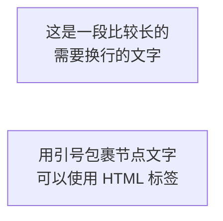

**Key configuration**:
```javascript
mermaid.initialize({
  flowchart: {
    padding: 32,
    nodeSpacing: 80,
    rankSpacing: 80,
    htmlLabels: true,
    wrappingWidth: 160,
  }
});
```
